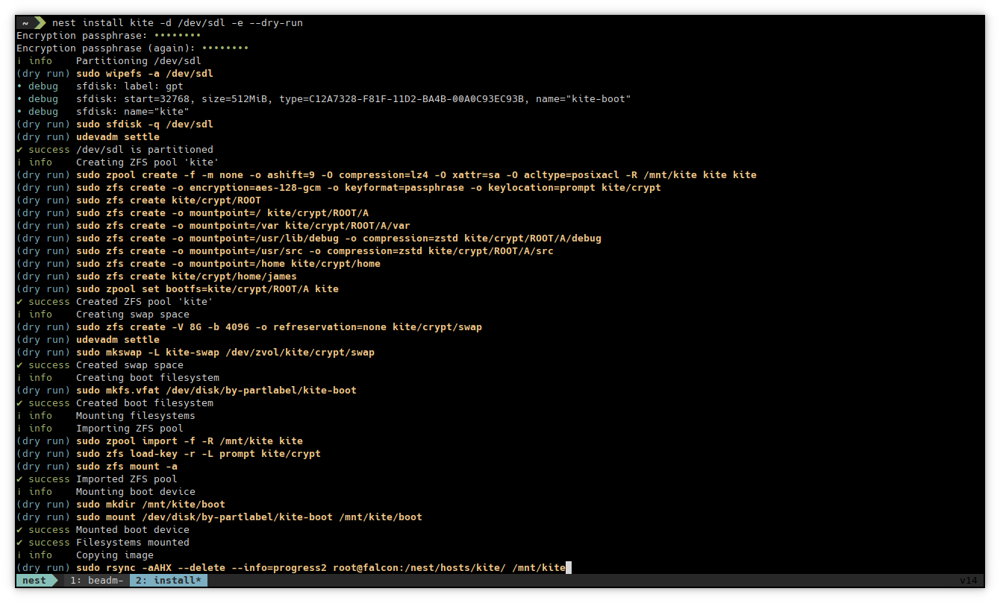

# Nest CLI

This is a collection of commands written in Ruby to install, update, and
generally administer the Nest distribution.

## Installation

[Puppet](https://gitlab.james.tl/nest/puppet/-/blob/main/manifests/base/cli.pp)
ensures the latest `app-admin/nest-cli` package from the [Nest
overlay](https://gitlab.james.tl/nest/overlay/-/tree/main/app-admin/nest-cli)
is installed.

## Usage

All commands provided by this program can be accessed by running `nest`. There
are subcommands to manage ZFS boot environments, install new hosts, update
existing hosts, and reset them back to the desired state.

| Commands                | Description                  |
|-------------------------|------------------------------|
| `nest beadm SUBCOMMAND` | Manage ZFS boot environments |
| `nest install NAME`     | Install a new host           |

### Boot Environments

`nest beadm` provides subcommands to create, destroy, mount, unmount, activate,
and query ZFS boot environments, which are clones of the OS filesystems
inspired by [the same concept in Solaris
11](https://docs.oracle.com/cd/E53394_01/html/E54749/aboutbes.html).  Boot
environments are used by the Nest installer to perform A/B seamless system
updates [similar to Android](https://source.android.com/devices/tech/ota/ab).

| Commands                     | Description                                                  |
|------------------------------|--------------------------------------------------------------|
| `nest beadm activate [NAME]` | Configure and enable a boot environment for mounting at boot |
| `nest beadm create NAME`     | Clone the current boot environment to a new one              |
| `nest beadm destroy NAME`    | Delete the specified boot environment                        |
| `nest beadm list`            | Print the names of all boot environments                     |
| `nest beadm mount NAME`      | Mount a boot environment under /mnt                          |
| `nest beadm unmount NAME`    | Unmount a boot environment under /mnt                        |
| `nest beadm status`          | Display the current and active boot environments             |

All of these commands accept a `--dry-run` argument to only print the changes
that would be made.

### Install

`nest install` is the Nest installer for hosts with a [Stage
3](https://gitlab.james.tl/nest/stage3) image. It understands everything from
partitioning to firmware installation and provides reasonable fault tolerance.

| Options                  | Description                                                                    |
|--------------------------|--------------------------------------------------------------------------------|
| `--clean`                | Just run the cleanup step                                                      |
| `-d DISK`, `--disk=DISK` | The disk to format and install on (*e.g.* /dev/sda or /tmp/boot.iso)           |
| `-e`, `--encrypt`        | Use ZFS encryption                                                             |
| `--force`                | Run cleanup actions (like `umount`) to try to correct unexpected system states |
| `-s STEP`, `--step=STEP` | Only run this installation step                                                |
| `--begin=STEP`           | The first installation step to run (default: `partition`)                      |
| `--end=STEP`             | The last installation step to run (default: `firmware`)                        |
| `--debug`                | Print additional information, such as the input provided to commands           |
| `--dry-run`              | Only print actions that would modify the system                                |

The steps are self explanatory and, unless specified with `--step`, `--begin`,
or `--end` options, run in the following order:

1. `partition`
2. `format`
3. `mount`
4. `copy`
5. `bootloader`
6. `unmount`
7. `firmware`
8. `cleanup` (not run by default)

## Development

This program is developed with Bundler. Initialize the project with `bundle
install`, then make changes to code under the `lib` directory. Check the code
with `bundle exec rake` and run the CLI with `bundle exec bin/nest`.

Prepare for release by bumping `VERSION` in `lib/nest/version.rb` and create a
new Git tag followed by a [new GitLab
release](https://gitlab.james.tl/nest/cli/-/releases/new).
